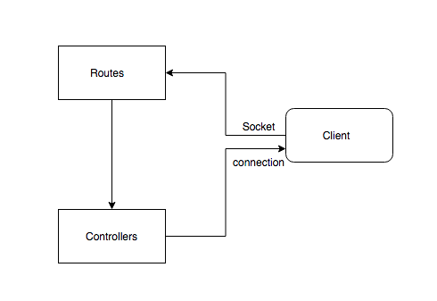

# MarvisX
MarvisX is a part of a voice controlled presentation navigation system see [Marvis](https://github.com/tinumide/Marvis/blob/master/README.md
)
## System Architecture :office:
</img>
## App Components
This part of the system interfaces with the web browser to display the results. The web browser is connected to the routes and controllers
via a web socket coonection. The [consumer service](https://github.com/tinumide/MarvisY) sends the command produced from marvis
as post request to the routes. The command is a Json object that contains an action and a query. The action is the intent of the user 
which would be to open a bible passage and the query would contain the bible passage that should be opened. An example of a command 
would be `{'action':'Open bible', 'query':'John1:1'}`. The route calls the controller to process the request. Then finally the cont
roller emits the resulted data to the web browser.
##Technologies Used
- Programming language
  - Python
- Web Framework
  - Flask
## Author
- Tinuade Adeleke @tinumide
